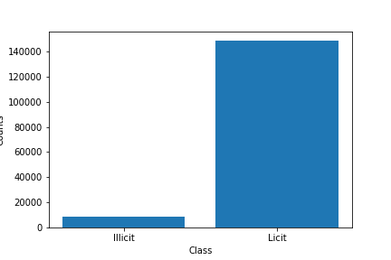

> “The Elliptic Data Set maps Bitcoin transactions to real entities belonging to licit categories (exchanges, wallet providers, miners, licit services, etc.) versus illicit ones (scams, malware, terrorist organizations, ransomware, Ponzi schemes, etc.). The task on the dataset is to classify the illicit and licit nodes in the graph.
> 
> **Content**
> 
> This anonymized data set is a transaction graph collected from the Bitcoin blockchain. A node in the graph represents a transaction, an edge can be viewed as a flow of Bitcoins between one transaction and the other. Each node has 166 features and has been labeled as being created by a "licit", "illicit" or "unknown" entity.
> 
> Nodes and edges
> The graph is made of 203,769 nodes and 234,355 edges. Two percent (4,545) of the nodes are labelled class1 (illicit). Twenty-one percent (42,019) are labelled class2 (licit). The remaining transactions are not labelled with regard to licit versus illicit.
> 
> **Features**
> 
> There are 166 features associated with each node. Due to intellectual property issues, we cannot provide an exact description of all the features in the dataset. There is a time step associated to each node, representing a measure of the time when a transaction was broadcasted to the Bitcoin network. The time steps, running from 1 to 49, are evenly spaced with an interval of about two weeks. Each time step contains a single connected component of transactions that appeared on the blockchain within less than three hours between each other; there are no edges connecting the different time steps.
> 
> The first 94 features represent local information about the transaction – including the time step described above, number of inputs/outputs, transaction fee, output volume and aggregated figures such as average BTC received (spent) by the inputs/outputs and average number of incoming (outgoing) transactions associated with the inputs/outputs. The remaining 72 features are aggregated features, obtained using transaction information one-hop backward/forward from the center node - giving the maximum, minimum, standard deviation and correlation coefficients of the neighbour transactions for the same information data (number of inputs/outputs, transaction fee, etc.).

First we load the data in a data frame, we then aim to understand the data: dimensions, first 5 rows etc. We process the “classes” data frame by replacing every instance of the ‘unknown’ class with -1 (licit is 2 and illicit is 1). This helps later on when we approach semi-supervised learning on graphs. 

We then provide a plot across the time steps where the count of licit, illicit and unknown transactions are counted. A simpler plot follows whereby a bar chart of the count of total unknown, licit, and illicit transactions are displayed. 

There are two primary approaches that we can take to solving this problem (classifying the unknowns). We can utilise a supervised classification approach (SVM, random forest, Adaboost) or we can utilise a semi-supervised approach on the graph structure (accounting for edges too).

**Supervised Approach**

In the first approach, supervised classification, we first remove all of the unknowns from the “features” dataset. This leaves us with only transactions that are known to be licit or illicit. We then have two approaches for splitting this remaining data into a training set and a test set. 

1. Take all transactions that occurred before time t (for some arbitrary 0 < t <= 49).
1. Take a random split of training and test from across all of the time steps.

Both approaches are valid and have appropriate uses and advantages in a real-world setting. We decide to adopt the second approach to splitting the data. 

Once splitting the data 80/20, we are left with training and test set of features of dimensions (37251, 167) and (9313, 167) respectively. We then apply SVM, Random Forest (max depth of 8, attained using a grid-search from 2-10), and Adaboost (with number of estimators equal to 100). 

We provide a table of the accuracy score (more metrics should have been considered) from these approaches below. 

* SVM: 0.959304198432299
* Random Forest: 0.9806721786749705
* Adaboost: 0.9873295393535918

We then apply the best performing (wrt accuracy) model from these onto the unknown dataset and observe the distribution of predicted licit to illicit transactions.

**Semi-supervised, Graphs and DeepWalk**

Following these more traditional approaches, I was excited by the prospect of working on and utilising the graph structure of the data provided. Note that in the previous approach, we did not utilise the "edge" dataset which provides descriptions of the edges between the vertices in the overall graph. Assuming that these edges convey information (which they do, each time-step is composed of a connected component of the overall graph), then we are missing a lot of vital information in our learning process. [DeepWalk](https://arxiv.org/abs/1403.6652) also proved fascinating to me as a way to encode graph-structure information by traversing the graph in random walks from each node and then using skipgram (with arbitrary window size) to create feature vectors corresponding to these nodes. Variants of these were also of interest such as Node2vec and weighted-walks. Note that DeepWalk is unbiased in nature, however with Bitcoin transactions, there is often information associated with each edge such as the transaction amount and the timestamp of the transaction. We could therefore, assuming the data is provided, construct walks such that emphasis is placed on one of these pieces of data (larger transaction amount may imply a stronger relationship between the recipient and sender? Varying timestamps may imply relational information too). Alas, the aforementioned approach is not suitable for the dataset provided and so we choose to utilise DeepWalk but such a biased formula may look like a^k * b^(1-k) where a is transaction amount, b is timestamp. We can vary k from 0 to 1 to shift the emphasis between these features. 

For the network portion of this problem, I decided to use the [networkx](https://networkx.org/) Python package. With this, we could load the graph using the edges (however, I found no way to incorporate the 167-dimensional feature vector for each vertex which may have been useful for GNN or GCN (graph convolutional network) approaches later on). Following this, I used [karateclub's](https://github.com/benedekrozemberczki/karateclub) DeepWalk with a small number for walk-length and number of walks due to time taken to train. The dimension of the resulting embedding matrix was (203769, 32), the first dimension indicating the number of nodes. It is worth noting that due to the semi-supervised approach, there was no filtering of 'unknown' nodes necessary, they can be utilised in the training process. 

For the next stage, I applied LabelSpreading to the embedding matrix. Confusion arose due to the lack of original feature information contained. The new embedding vector only utilised the structure of the edges and nodes and so ignored the initial features associated with each node. When considering ways to incorporate this information, I thought that a merging of arrays (original feature matrix and new embedding matrix) may suffice, however this task was tedious given the time taken to train (dimensionality-reduction may have provided utility here). Therefore, only the embedding matrix was used in LabelSpreading. 

Experimentation with the merging of these data may be worth considering in the future. Choosing either one exclusively is missing a lot of important data. 

**Further**

When searching for ways to incorporate feature information, I came across [Label-GCN](https://arxiv.org/pdf/2104.02153.pdf) published partly by Elliptic and thus using the same dataset. This paper provides a manner in which initial labels can be incorporated into the graph structure and thus utilised by the GCN. This may partially answer my final question, however it is in a GCN-setting and not the DeepWalk embedding + semi-supervised algorithm setting. 

Class imbalance is also an issue that should be addressed and compared, the initial set is around 40k : 5k (licit : illicit). In a real-world setting, one might imagine that a false positive is a greater hassle (economically) for the company than a false negative (where they can just dig deeper into the user). Other metrics (precision, sensitivity) may be worth evaluating in this context. 
